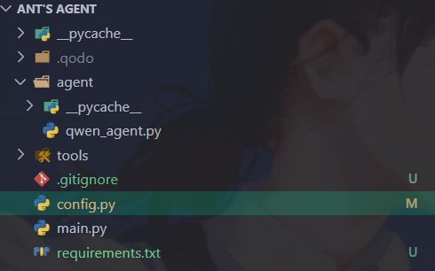
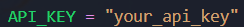
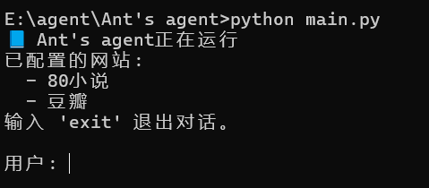

## Ant's agent

### 这是什么 🤔

一个基于python的简易爬虫agent，我希望它像蚂蚁一样：简单高效有序，只关注实际结果，所以给它取了这个名字。

通过预设的白名单或者提供link，它可以总结页面内容并提供摘要，最后整理该页面所有可访问link。你可以与它沟通来继续深入获取信息，它会自己决策应该过滤哪些内容，如何整理有用信息。相比于传统爬虫或官网的对话大模型，它能通常能更高效细致地获取信息。

### 如何开始 ⚙

首先下载所需要的依赖

```shell
pip install -r requirements.txt
```

接下来打开项目根目录，找到config.py



修改常量API_KEY，替换为你自己的



然后就可以启动项目了

```shell
python main.py
```



### 一点想法  😎

有想法一起更新这个项目的朋友欢迎fork.